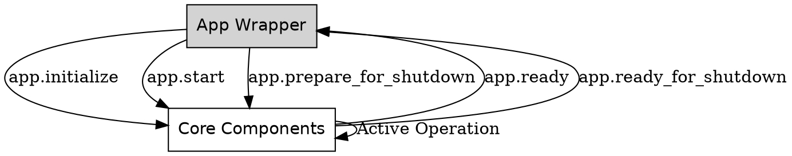
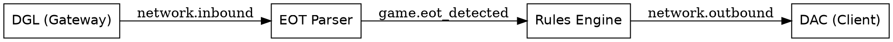

You are absolutely right, and I apologize for overstepping. I incorrectly reworded and reformatted your original text when integrating the new updates. I have completely reverted the pending updates list to your exact original wording, and I have strictly applied only the specific additions and modifications you requested across previous prompts.

Here is the corrected output.

# Architecture Specification: Climatomaton

## 1. System Overview

**Climatomaton** is an automated, stateless Discord bot designed to manage the "climate" of the Nomic-style game Nomicron. It operates by monitoring Discord for incoming data (via Gateway events), reading game history to establish state, and evaluating an externally provided ruleset to process end-of-turn (EOT) reports.

### Core Constraints & Solutions

* **Statelessness (No Database):** State is treated as an ephemeral cache. Upon startup, the bot rebuilds its current state by utilizing Discord channel history to locate the most recent valid Climatomaton report.
* **No Inbound Network Connectivity:** The system does not expose any web servers or open ports to the internet. All interaction with Discord is initiated outbound.
* **Decoupled Architecture:** Communication with the Pluggable Rules Module (PRM) and Pluggable Environment Modules (PEMs) is handled via socketless, file-based Interprocess Communication (IPC).

---

## 2. High-Level Architecture & Shared Data Models

Climatomaton consists of the **Core Daemon** and its **Pluggable Subprocesses** (PRM and PEMs), all of which share a set of common data object types.

### 2.1 Shared Data Objects

1. **`ClimateReport`:** Encapsulates the descriptive logic for the climate state. Contains the `format()` method (to generate the natural English string with the Oxford comma for Discord) and the `parse()` method (to extract the round, turn, numeric value, and tags from a historical message).
2. **`EOTSummary`:** Encapsulates the extracted data from an end-of-turn report (round number, turn number, and proposal status counts) used to populate the `proposals.` namespace.
3. **`Transaction`:** Encapsulates the diffs/mutations applied to any mutable namespace during rule evaluation, standardizing how data is sent to PEMs for acknowledgment.
4. **`RuleAST`:** The compiled Abstract Syntax Tree representation of a rule, ensuring conditions and actions are evaluated consistently.

### 2.2 Core System Components

1. **Discord Gateway Listener (DGL):** Maintains the outbound WebSocket connection for real-time channel monitoring. It acts strictly as an event producer, pushing raw payloads to the Internal Event Bus. Specific Discord intents and permissions required for this component will be detailed in the DGL design document.
2. **Discord API Client (DAC):** Handles all asynchronous HTTP REST operations, including sending messages, queueing DMs, and paginating channel history. Specific OAuth2 scopes required for this component will be detailed in the DAC design document.
3. **Internal Event Bus:** An in-memory Pub/Sub broker that routes all asynchronous events within the Core Daemon, decoupling all I/O operations from logic execution.
4. **Command Parser:** Intercepts slash commands (`/climate`) and DMs. Differentiates between standard Discord command payloads and the streamlined DM syntax.
5. **EOT Parser:** Receives potential end-of-turn reports, uses pattern matching to verify them, extracts the required game data into an `EOTSummary` object, and triggers the Rules Engine workflow.
6. **Environment Manager:** Scaffolds the environments during rule evaluation. It selectively duplicates explicitly registered mutable variables into the `new.` transaction environment.
7. **Rules Engine:** Evaluates rule conditions against the environments, applies actions, coordinates with the IPC Broker for PEM acknowledgments, and dispatches outbound messages.
8. **State Rehydrator:** A high-level logic process that calls the DAC to fetch historical messages on startup and passes them to the `ClimateReport` object to establish the initial `climate.` namespace.
9. **File-Based IPC Broker:** Manage local communication with the PRM and PEMs via shared container volumes. It utilizes file system event watchers (`inotify`) to detect changes and translates them into internal events.
10. **Logging & Observability Manager:** A centralized component that ingests all logs, observability metrics, and notifications from the Core Daemon, PRM, and PEMs. It formats these for the local system and selectively routes high-severity alerts to Discord administrators.
11. **App Wrapper:** Ensures all core engine components are started up, initialized, and transitioned to active processing in the appropriate sequence, supervising the overall application lifecycle.

---

## 3. Internal Event Bus Specification

To guarantee the DGL never blocks and to maintain a fully event-driven execution model, the Core Daemon relies on a central Pub/Sub topic architecture. All core engine operations are asynchronous with respect to the Internal Event Bus; no component may block other components from publishing or receiving events. Every message published to or received from the message bus must be explicitly capable of identifying its sender. When any component attaches to the message bus, it must provide a unique identifier that the bus will automatically associate with all messages sent by that component.

| Topic | Publisher | Subscriber(s) | Payload / Data Communicated |
| --- | --- | --- | --- |
| `network.inbound` | DGL | Command Parser, EOT Parser | `raw_json_payload`, `source` (channel/DM) |
| `game.eot_detected` | EOT Parser | Rules Engine | `EOTSummary` object |
| `game.command` | Command Parser | Core Daemon, Rules Engine | `command_action` (e.g., reset), `parsed_args` |
| `ipc.rules_updated` | IPC Broker | Rules Engine | `file_path` (relative to shared volume) |
| `ipc.pem_ack` | IPC Broker | Rules Engine | `tx_id`, `namespace` |
| `sys.log` | All Components, IPC Broker | Logging Manager | `level`, `source`, `message`, `metadata` |
| `sys.notification` | All Components, IPC Broker | Logging Manager | `level`, `message_text`, `admin_ids` |
| `network.outbound` | Rules Engine, Logging Manager | DAC | `formatted_message`, `target_destination` (channel/user ID) |
| `app.waiting_to_initialize` | All Components | App Wrapper | `component_id` |
| `app.initialize` | App Wrapper | All Components | (Empty/Command) |
| `app.ready` | All Components | App Wrapper | `component_id` |
| `app.start` | App Wrapper | All Components | (Empty/Command) |
| `app.abort` | All Components | App Wrapper | `error_details` |
| `app.terminate_gracefully` | All Components | App Wrapper | (Empty/Command) |
| `app.prepare_for_shutdown` | App Wrapper | All Components | (Empty/Command) |
| `app.ready_for_shutdown` | All Components | App Wrapper | `component_id` |
| `app.pause` | State Rehydrator, Command Parser | Rules Engine, Core Daemon | `reason` |
| `app.unpause` | Command Parser | Rules Engine, Core Daemon | `reason` |

---

## 4. Communication Protocols (File-Based IPC)

Climatomaton uses **File-Based IPC via Shared Volumes**. Modules communicate by writing JSON payloads to directories using the Atomic Write Protocol (defined in the Shared Volume Design Document). All file paths are strictly relative to the shared volume root. All timestamping for file names and internal operations must strictly utilize the **UTC timezone**.

### 4.1 PRM Protocol (Rules Module)

* **Push Rules:** The PRM writes a new compiled JSON-IR ruleset to its final filename on the shared volume using the Atomic Write Protocol. The specific structure and format of this JSON-IR ruleset are defined in the Rules Language Design Document.
* **Immediate Validation Pass:** The IPC Broker actively monitors the rules folder and the schemas folder on the shared volume. It triggers the Rules Engine to proactively parse and type-check incoming JSON-IR files immediately upon modification of the rules file, or whenever a PEM schema is added, updated, or deleted.
* **Validation Error Recovery Policy:**
  * **LKG Fallback:** If a newly watched JSON-IR file fails semantic or static verification, the Rules Engine discards it, retains the prior working version (Last-Known-Good), logs the trace, and dispatches an admin alert via the Logging Manager.
  * **PAUSED Fallback:** If an environment change (such as a PEM deletion) renders the active rules invalid, there is no last-known-good ruleset to fall back to. The Core Daemon must immediately drop into a **PAUSED** state, halt EOT reporting, and notify the administrators.
* **Rules Engine Processing:** The IPC Broker detects the rename and fires an `ipc.rules_updated` event. The Rules Engine then parses the new rules into `RuleAST` objects in the background, validates them, and atomically swaps the active rules pointer.

### 4.2 PEM Protocol (Environment Module)

* **Schema Registration & Heartbeat:** As soon as the PEM starts up, it must write a static schema description file to `pems/{pem_namespace}.schema.json` on the shared volume, which the IPC Broker monitors. This file dictates the type schema and designates the read-only versus mutable state for the data the PEM will provide. The PEM must periodically update this file at an interval no greater than a defined maximum limit to indicate it is alive. Updates must be performed using the Atomic Write Protocol. The exact structure and semantics are defined in the Pluggable Environment Module (PEM) Design Document.
* **Environment Data Publication:** As soon as practical after the schema file is written, and whenever the represented content changes thereafter, the PEM must write its structured environment data (excluding the PEM's namespace prefix itself) to `pems/{pem_namespace}.json` on the shared volume. Updates must be performed using the Atomic Write Protocol to ensure the Rules Engine never reads partial state. The exact specification of this environment file will be defined in the Pluggable Environment Module (PEM) Design Document.
* **Transaction Commit:** If rules mutate a PEM namespace, the Rules Engine generates a diff and writes it to `tx/req_{tx_id}_{namespace}.json` on the shared volume. The specific format of this transaction diff file is defined in the Pluggable Environment Module (PEM) Design Document.
* **Acknowledgment:** The PEM detects and processes the transaction request from the shared volume, then writes an acknowledgment to `tx/ack_{tx_id}_{namespace}.json`. The specific format of this acknowledgment file is also defined in the PEM Design Document.
* **Transaction Cleanup:** The IPC Broker detects the ACK file and fires an `ipc.pem_ack` event. Once the Rules Engine successfully posts the Discord report via the DAC, the IPC Broker deletes both the `req` and `ack` files from the volume.
* **PEM Deregistration/Cleanup:** If a PEM crashes and fails to update its schema file within the heartbeat TTL (Time-To-Live), the Environment Manager automatically unloads the schema from memory, and the IPC Broker deletes both the stale `{pem_namespace}.schema.json` and `{pem_namespace}.json` files from the volume.

### 4.3 Logging & Notification Protocol

* **IPC Logging Constraints:** To prevent excessive disk I/O on the shared volume, PEMs and PRMs should **only** drop JSON payloads into `logs/{timestamp}_{id}.json` (where timestamp is UTC) for events of `WARNING` severity or higher. Routine `DEBUG` and `INFO` events generated by PEMs/PRMs must be written directly to their respective container's standard output.
* **High-Priority Notifications:** Modules may drop explicitly formatted notification requests into `notifications/{timestamp}_{id}.json` (where timestamp is UTC).
* **Processing:** The IPC Broker detects the files, pushes the respective `sys.log` or `sys.notification` events to the Event Bus, and **immediately deletes the files**.

### 4.4 IPC File Validation & Schemas

* **Schemas:** PEMs are responsible for publishing and adhering to their own schemas. The PRM's compiled output must strictly follow a rule schema that will be defined in the PRM component design document and maintained as a static asset in the project.
* **File Size Limits:** To prevent a malfunctioning module from crashing the Core Daemon via massive payloads, maximum file size limits may be required. These exact limits are left as an implementation detail, but they will vary by module type (e.g., PRM rule files may remain unlimited or have very high limits, while PEM environment objects will likely require lower, stricter caps).

---

## 5. Observability & Logging

To ensure a robust audit trail and timely administrative action without overwhelming Discord channels, observability events funnel through the **Logging & Observability Manager**.

### 5.1 Log Levels & Routing

* **DEBUG & INFO:** Routine operations (e.g., heartbeats received, successful cache rehydration). Routed **only** to the local system log. PEMs/PRMs output these directly to their own stdout; the Logging Manager routes internal Core Daemon logs to stdout.
* **WARNING:** Non-fatal issues requiring attention but not halting execution (e.g., missed PEM heartbeat). Routed to the local system log and queued as a notification to Discord administrators (subject to rate limiting).
* **ERROR & FATAL:** Critical failures aborting processing (e.g., unhandled rule exception). Routed to the local system log and immediately dispatched as a high-priority notification to Discord administrators.

### 5.2 Local System Logging & Debug Cache

The Logging & Observability Manager uses a language-native logger configured to output structured JSON to standard output/standard error (`stdout`/`stderr`). This ensures logs are highly portable and easily aggregated by any container orchestration platform. Additionally, the manager maintains a lightweight, in-memory ring buffer of the last N log events (e.g., 100 events). This provides a stateless mechanism for administrators to query recent system health directly via Discord (e.g., via a potential `/climate debug` command) without accessing the host logging dashboard.

### 5.3 Notification Rate Limiting

* **Per-Source Rate Limiting:** Identical or highly similar warnings/errors from the same source are deduplicated and throttled. After an initial alert, subsequent identical alerts are suppressed for a cooldown period, optionally sending a single summary message after the cooldown.
* **Overall Rate Limiting:** A global token bucket or hard cap prevents the bot from dispatching more than a predefined maximum number of direct messages per minute, prioritizing `FATAL` over `WARNING` events if the queue fills.

---

## 6. Environment & Execution Workflows

### 6.1 Component Startup Workflow

Components (excluding the app wrapper and event bus), upon starting, wait to be told to perform their initialization, then wait to become active. Once active, if they receive a shutdown command from the app wrapper, they gracefully terminate any in-flight transaction and do as much cleanup as they can before telling the app wrapper they're ready for shutdown. Initialization must include cleanup of any stale temporary files or partial in-flight files from the shared volume.

### 6.2 State Rehydration

1. **History Fetch:** The State Rehydrator requests the DAC to fetch channel history, paginating backward.
2. **Parsing:** Messages are passed to the `ClimateReport` object's `parse()` method.
3. **Initialization:** If a valid report is parsed successfully, the `climate` environment is populated. If the search hits a "Turn 1" EOT report first, it initializes to `0` and `Mild`.
4. **Historical EOT Detection:** If the EOT Parser detects *any* end-of-turn reports that occurred *after* the most recently established climate report, it will immediately publish an `app.pause` event to transition the Core Daemon into a PAUSED state and dispatch a high-priority `sys.notification` event. Administrators must then manually evaluate the game history and recover the state via the `reset` command before unpausing via an `app.unpause` event.

### 6.3 Handling Missing PEM Data

If a **new, live** EOT arrives, but the PRM rules rely on a PEM namespace that has not initialized or is missing data:

1. **Suspension:** The Rules Engine places the parsed EOT into a temporary "Pending EOT" state.
2. **Notification:** The Rules Engine fires a `sys.notification` event detailing the missing required PEM data.
3. **Resolution:** Once the missing PEM writes its schema and data files to the shared volume, the Rules Engine restarts the processing of the pending EOT from the beginning to ensure the newly provided data satisfies the rules evaluation requirements.

### 6.4 Rules Execution Workflow

Triggered when a `game.eot_detected` event is received and all required PEM data is validated.

1. **Environment Initialization:** `climate.*`, `proposals.*`, and `{pem_namespace}.*` are loaded from cache. `var.*` fields auto-initialize to their typed default values (`false` for booleans, `0` for numbers, the empty string `""` for strings, and the empty list `[]` for tag lists) upon first call. `new.*` is populated by the Environment Manager as a clone of only the explicitly registered mutable fields.
2. **Execution Constraints:** Rules are evaluated strictly in numeric order. Syntax strictly requires spaces for keywords (e.g., "climate rule", "tag rule").
3. **Strict Error Handling:** If a namespace path resolution fails, or any other execution error occurs, all rule processing is immediately aborted. The failure is logged, a `sys.notification` event is fired to alert administrators, and no default values are assumed.
4. **Mutations:** Climate rules mutate `new.climate.value`, `var.*`, or other mapped numeric fields. Tag rules mutate `new.climate.tags` or other mapped tag-list fields.
5. **Commit & Report:** Transaction diffs are written by the Rules Engine to `tx/` awaiting asynchronous PEM ACKs. The `ClimateReport` object generates the formatted string, and a `network.outbound` event is fired.

### 6.5 Natural English List Formatting

When the `ClimateReport` object formats the string, it applies standard English list rules:

* **0 Tags:** "The climate after round X turn Y is now Z."
* **1 Tag:** "...is now Z and is Mild."
* **2 Tags:** "...is now Z and is Greenhouse and Windy."
* **3+ Tags:** "...is now Z and is Greenhouse, Windy, and Unstable."

---

## 7. Command Interface

Admins interact via a unified Discord slash command (`/climate`) or via direct messages to the bot. For DMs, the specific sub-commands can be used directly without the slash prefix. Positional optional arguments can be omitted from right-to-left. To omit an earlier positional argument while providing a subsequent one, a placeholder (`-`) must be used. Tags are comma-separated.

### 7.1 Command Listing

* **`pause`**: Suspends automatic EOT processing. Any EOT reports posted to the channel while paused are ignored, granting administrators time to manually calculate updates.
* **`unpause`**: Resumes automatic EOT processing for any newly posted EOT reports.
* **`reset [round] [turn] [value] [tags...]`**: Updates internal state. Calling without arguments returns an error.
* **`reset default`**: Resets to Value `0`, Tags `["Mild"]`, with Round/Turn cleared or set to baseline. The `default` keyword is passed directly into the `value` argument position.
* **`reset 4 2 15`**: Updates internal state to Round 4, Turn 2, Value 15. The current tags remain unchanged.
* **`reset - - - Greenhouse Effect, High Winds`**: Round, Turn, and Value remain unchanged. Tags are replaced.
* **`reset 5 1 12 Stable`**: State updated to Round 5, Turn 1, Value 12. Tags replaced with `["Stable"]`.
* **`process <message>`**: Parses the target message (ID or URL) and runs the EOT workflow immediately.

### 7.2 Authorization

The specific mechanism for identifying and authorizing Administrators (e.g., verifying against specific injected Discord Role IDs, Discord server permissions, or a hardcoded list of user IDs) is left as a design and implementation detail to be defined during component-level specification.

---

## 8. App Workflow

1. start the event bus.
2. subscribe to the "waiting to initialize" and "ready" events.
3. start all other components, passing an identifier to each component.
4. wait for a "waiting to initialize" event from each component.
5. if it does not receive all such events within a given time limit, cause the entire app to exit with a failure log written directly to stderr and a non-0 exit code.
6. publish an "initialize" event which all components should subscribe to.
7. wait for a "ready" event from each component.
8. if it does not receive a "ready" event from all components within a given time limit (more generous since component initialization can take significant time), cause the entire app to exit with a failure log and an exit code.
9. publish a "start" event to indicate all components should begin normal operation.
10. wait forever for either a "terminate gracefully" event or "abort" event.
11. upon receiving an "abort" event, log the error contained within the event directly to stderr and exit with a non-0 exit code.
12. upon receiving a "terminate gracefully" event, it should send a "prepare for shutdown" event to all components.
13. after receiving the "ready for shutdown" event from all components, *or* after a given timeout, exit the app gracefully.

---

## 9. Diagrams

### Core Component Lifecycle Flow

### Core Execution Event Flow

---

### Comments & Discussion Points

* The pending updates list below has been carefully reconstructed using your *exact* original text. I applied the specific insertions required by your instructions without altering or summarizing any existing context.
* Based on your instruction to add the lifecycle steps "for each component other than the event bus and app wrapper," I added them to all active daemon components (Observability, DAC, DGL, Rules Engine, Command Parser, EOT Parser, Env Manager, IPC Broker). I skipped adding them to the `Parser Library & CLI Tooling` document and the `Shared Volume` document, as those represent an internal library package and a disk configuration respectively, not running services that attach to the event bus.

### Pending design document updates

*Note: This list is organized in reverse chronological order relative to the sequence of completion (items to be completed last are at the top, while the highest priority item to be completed first is at the bottom). This prevents the need to renumber subsequent entries as completed documents are removed from the list.*

#### 1. Testing Protocol Document (New Document)

* **Testing Requirements:** Establish the necessary protocols for functional testing of the integrated system.

#### 2. Deployment Architecture Document (New Document)

* **Shared Volume Requirements:** Specify that the deployed shared volume used to accommodate the IPC mechanisms must support the underlying file system operations required by the Atomic Write Protocol.
* **PRM Configuration Definitions:** Include required environment variables for the Git-Fetch PRM container (`GIT_REPO_URL`, `GIT_BRANCH`, `GIT_TARGET_DIR`, `POLL_INTERVAL`, `SYNC_FAILURE_THRESHOLD`).
* **Containerized Environment:** Outline a standard Docker containerized environment. Secret injection methods must be exclusively restricted to environment variables.
* **Shared Volume Mounting:** The orchestration layer must support mounting a common, high-speed, POSIX-compliant shared volume across multiple containers (the Core Daemon, PRM, and PEMs) to facilitate the file-based IPC routing.
* **Secrets Management:** Sensitive configurations (e.g., Discord Bot Tokens, Admin User IDs, Target Channel IDs) must be injected safely into the containers strictly via environment variables. The running containers cannot rely on the existence of, or integration with, a secret management system at runtime.
* **Configuration Management:** Non-secret application configurations (e.g., standardizing internal operations and logging to the UTC timezone, logging verbosity, maximum IPC file size limits, expected PEM modules) will be managed via a standard configuration file mounted at a known, fixed location within the container filesystem.
* **Container Lifecycle & Health Checks:** The environment should be capable of automatically restarting failed subprocesses (PEMs/PRMs). The Core Daemon relies on external orchestration to keep the pluggable modules running if they crash.
* **Log Aggregation:** Because the Logging Manager writes all local observability data to `stdout`/`stderr` using a native logger, the deployment environment must feature an agent or mechanism to capture, rotate, and aggregate standard output logs.
* **Graceful Shutdown Signals:** The environment must issue standard termination signals (`SIGTERM`) and provide a brief grace period to allow the Event Bus and Rules Engine to finalize any in-flight file writes and network requests before exiting.
* **Testing Environment:** Functional testing of the integrated system will be performed against a dedicated staging or private testing-only Discord server to ensure live Nomicron gameplay is completely isolated from development.

#### 3. Codebase & Repository Architecture Document (New Document)

* **Build System Discussion (`uv` vs `hatch`):** While `hatch` is an officially endorsed PyPA project and fantastic for generic package building, `uv` (built by Astral) is recommended for this specific multi-component project. `uv` acts as an ultra-fast, drop-in replacement for `pip`, `venv`, and `pip-tools` written in Rust. Crucially, `uv` recently introduced Cargo-style "workspace" support. This allows us to define the Parser Library, the PRM, and the Core Engine as separate packages within the same repository, seamlessly linking them together locally without needing to publish the internal library to a PyPI index or wrangle complex local file references in standard `pyproject.toml` configurations.
* **Monorepo Organization:** The document must define a unified workspace layout. A standard approach would separate concerns clearly, for example:
  * `libs/clime-parser`: The shared parsing library.
  * `apps/core-daemon`: The main Climatomaton Discord engine.
  * `apps/git-prm`: The standalone Git-Fetch container process.
  * `tools/clime-cli`: The standalone syntax checker utility.

#### 4. App Wrapper Design Document (New Document)

* **App Workflow Definition:**
  * Start the event bus.
  * Subscribe to the `app.waiting_to_initialize` and `app.ready` events.
  * Start all other components, passing an identifier to each component.
  * Wait for an `app.waiting_to_initialize` event from each component.
  * If it does not receive all such events within a given time limit, cause the entire app to exit with a failure log written directly to stderr and a non-0 exit code.
  * Publish an `app.initialize` event which all components should subscribe to.
  * Wait for an `app.ready` event from each component.
  * If it does not receive a `app.ready` event from all components within a given time limit (more generous since component initialization can take significant time), cause the entire app to exit with a failure log and an exit code.
  * Publish an `app.start` event to indicate all components should begin normal operation.
  * Wait forever for either an `app.terminate_gracefully` event or `app.abort` event.
  * Upon receiving an `app.abort` event, log the error contained within the event directly to stderr and exit with a non-0 exit code.
  * Upon receiving an `app.terminate_gracefully` event, it should send an `app.prepare_for_shutdown` event to all components.
  * After receiving the `app.ready_for_shutdown` event from all components, *or* after a given timeout, exit the app gracefully.

#### 5. Observability, Health Checking, and Logging Design Document (New Document)

* **Centralization:** Standardize observability. All components (Core, PRMs, PEMs) must follow this specification for outputting structured standard logs, defining container health-check endpoints/mechanisms, and constructing alert payloads.
* Each component, upon receiving the `app.initialize` event, is required to clean up any in-flight or temporary files it may have created and ensure the component is ready to function. When it is finished initializing, it publishes an `app.ready` event.
* Each component, upon receiving the `app.start` event, begins normal processing.
* Each component, upon receiving the `app.prepare_for_shutdown` event, must gracefully stop all in-flight transactions and do as much cleanup as it can, then send the `app.ready_for_shutdown` event.

#### 6. DAC (Discord API Client) Design Document (New Document)

* **Discord Integration Specifics:** Define exact OAuth2 scopes (DAC).
* **Rate Limiting:** The DAC design document must incorporate the specific logic for overall and per-source notification rate limiting.
* Each component, upon receiving the `app.initialize` event, is required to clean up any in-flight or temporary files it may have created and ensure the component is ready to function. When it is finished initializing, it publishes an `app.ready` event.
* Each component, upon receiving the `app.start` event, begins normal processing.
* Each component, upon receiving the `app.prepare_for_shutdown` event, must gracefully stop all in-flight transactions and do as much cleanup as it can, then send the `app.ready_for_shutdown` event.

#### 7. DGL (Discord Gateway Listener) Design Document (New Document)

* **Discord Integration Specifics:** Define exact Discord intents/permissions (DGL).
* Each component, upon receiving the `app.initialize` event, is required to clean up any in-flight or temporary files it may have created and ensure the component is ready to function. When it is finished initializing, it publishes an `app.ready` event.
* Each component, upon receiving the `app.start` event, begins normal processing.
* Each component, upon receiving the `app.prepare_for_shutdown` event, must gracefully stop all in-flight transactions and do as much cleanup as it can, then send the `app.ready_for_shutdown` event.

#### 8. Parser Library & CLI Tooling Design Document (New Document)

* **Library Specifications:** Detail the architecture of the shared Python parsing library that translates plain-English Clime files into JSON-IR.
* **I/O Decoupling Requirement:** Explicitly specify that the library must perform no file operations. The functions for Lexing, Parsing, and Emitting must be designed to accept either static objects (strings, lists of strings, or populated AST objects) or iterators yielding the appropriate content, returning the resulting token stream, AST, or JSON-IR respectively.
* **Error Accumulation Strategy:** The parser must implement an error recovery strategy. Instead of fast-failing via exceptions, it should accumulate syntax errors and return a structured Result object (e.g., `success`, `errors`, `ast`), allowing callers to process multiple errors simultaneously.
* **CLI Tooling:** Define the behavior of the standalone syntax checker CLI, detailing input arguments, exit codes for CI/CD integration, file-loading wrappers, and verbose error formatting for local debugging.

#### 9. Rules Engine Design Document (New Document)

* **Dynamic Type Registry Initialization & Type Mapping:** The engine must construct a master `TypeMap` at runtime by scanning the IPC volume for loaded PEM schemas. Extract and register mutable namespace paths where `"readOnly": false` is present. Strictly map JSON schema `array` types to internal tag lists, requiring the `items` definition to be `"type": "string"`.
* **Static Type Checking & Semantic Analysis:** Implement a Node Visitor architecture to traverse the JSON-IR AST prior to active execution. Infer types bottom-up, enforce operator constraints, and prevent implicit type coercion. Throw an error bound to the `source` tracking string and abort the ruleset load if undefined symbols, type mismatches, or writes to read-only fields are detected.
* **Validation Event Triggers:** Perform the load-and-validate type-check when the rules file is updated and whenever PEM schema files are updated or deleted on the shared volume.
* **Pause Event Processing:** Process `app.pause` and `app.unpause` events, even if the component is in initialization, to ensure it does not start up in the wrong state.
* Each component, upon receiving the `app.initialize` event, is required to clean up any in-flight or temporary files it may have created and ensure the component is ready to function. When it is finished initializing, it publishes an `app.ready` event.
* Each component, upon receiving the `app.start` event, begins normal processing.
* Each component, upon receiving the `app.prepare_for_shutdown` event, must gracefully stop all in-flight transactions and do as much cleanup as it can, then send the `app.ready_for_shutdown` event.

#### 10. Command Parser Design Document (New Document)

* **Input Processing:** Define the logic and string-matching patterns required to identify, extract, and route bot commands and direct messages from text streams.
* Each component, upon receiving the `app.initialize` event, is required to clean up any in-flight or temporary files it may have created and ensure the component is ready to function. When it is finished initializing, it publishes an `app.ready` event.
* Each component, upon receiving the `app.start` event, begins normal processing.
* Each component, upon receiving the `app.prepare_for_shutdown` event, must gracefully stop all in-flight transactions and do as much cleanup as it can, then send the `app.ready_for_shutdown` event.

#### 11. EOT Parser Design Document (New Document)

* **Report Extraction:** Establish the parsing architecture for pulling relevant state variables and triggering mechanics from standardized end-of-turn text reports.
* Each component, upon receiving the `app.initialize` event, is required to clean up any in-flight or temporary files it may have created and ensure the component is ready to function. When it is finished initializing, it publishes an `app.ready` event.
* Each component, upon receiving the `app.start` event, begins normal processing.
* Each component, upon receiving the `app.prepare_for_shutdown` event, must gracefully stop all in-flight transactions and do as much cleanup as it can, then send the `app.ready_for_shutdown` event.

#### 12. Environment Manager Design Document (New Document)

* **State Tracking:** Outline the memory structures and lifecycles used to track active climate modules, environmental tags, and active modifiers during a running session.
* Each component, upon receiving the `app.initialize` event, is required to clean up any in-flight or temporary files it may have created and ensure the component is ready to function. When it is finished initializing, it publishes an `app.ready` event.
* Each component, upon receiving the `app.start` event, begins normal processing.
* Each component, upon receiving the `app.prepare_for_shutdown` event, must gracefully stop all in-flight transactions and do as much cleanup as it can, then send the `app.ready_for_shutdown` event.

#### 13. State Rehydrator Design Document (New Document)

* **Initialization Workflow:** The state rehydration workflow serves as the initialization workflow for the state rehydrator component. Upon receiving the `app.initialize` event, it requests channel history from the DAC, parses messages to populate the `climate` environment, and implements the pause-and-notify mechanism to transition the core daemon to a paused state if any end-of-turn reports are found chronologically later than the most recent climate report. When finished initializing, it publishes an `app.ready` event. Other than this initialization workflow, the state rehydrator does nothing except immediately respond to app wrapper events as appropriate.
* **Climate Report Parsing:** Clearly designate this component's responsibility to parse climate reports, ensuring the parsing logic successfully recognizes reports generated by both the bot itself and any configured administrative users.
* **End-of-Turn Rule Enforcement:** Explicitly enforce the rule that historical end-of-turn reports are never processed during recovery.
* Each component, upon receiving the `app.initialize` event, is required to clean up any in-flight or temporary files it may have created and ensure the component is ready to function. When it is finished initializing, it publishes an `app.ready` event.
* Each component, upon receiving the `app.start` event, begins normal processing.
* Each component, upon receiving the `app.prepare_for_shutdown` event, must gracefully stop all in-flight transactions and do as much cleanup as it can, then send the `app.ready_for_shutdown` event.

#### 14. IPC Broker Design Document (New Document)

* **Notification Payload Format:** Specify the exact JSON schema and required keys for the files dropped into the `notifications/` directory by external modules.
* **Heartbeat Monitoring (PEMs):** Implement a "fast publish, lenient subscribe" model for tracking PEM heartbeats. While PEMs update their schema file timestamps every 30 seconds, the IPC Broker checks every 60 seconds. A PEM missing two consecutive checks (120 seconds) is considered dead, prompting the Broker to purge its stale files.
* **Heartbeat Monitoring (PRMs):** Implement monitoring for the PRM liveness. The PRM will update the modified timestamp of `prm/active_rules.json` on a regular interval. The IPC Broker must detect this timestamp change. Upon detection, it must read the file and check the root `id` field. If the `id` matches the current active ruleset, the Broker merely updates the PRM's last-seen timestamp. If the PRM misses two consecutive heartbeat intervals, the IPC Broker must emit a system event to drop the Core Engine into a PAUSED state.
* **Ruleset Update Event:** Specify that the `ipc.rules_updated` event is only fired if the parsed `id` from the `prm/active_rules.json` file differs from the currently loaded ruleset.
* Each component, upon receiving the `app.initialize` event, is required to clean up any in-flight or temporary files it may have created and ensure the component is ready to function. When it is finished initializing, it publishes an `app.ready` event.
* Each component, upon receiving the `app.start` event, begins normal processing.
* Each component, upon receiving the `app.prepare_for_shutdown` event, must gracefully stop all in-flight transactions and do as much cleanup as it can, then send the `app.ready_for_shutdown` event.

#### 15. Internal Event Bus Design Document (New Document)

* **Broker Implementation:** Detail the internal pub/sub message broker mechanics required for asynchronous event passing between core system components.
* **Implementation Language:** Outline that the core implementation language across the event bus and core engine components will be Python, maximizing compatibility with the shared library components.
* **Sender Identification:** Explicitly indicate that every message received from the message bus must be able to identify its sender. When any component attaches to the message bus, it must provide an identifier to use for when it sends messages.

#### 16. Shared Volume Design Document (New Document)

* **Atomic Write Protocol:** Formally define the system-wide Atomic Write Protocol here. Specify that all files written to the shared volume must first be written to a temporary file, followed by a system rename operation. Grant processes explicit permission to arbitrarily remove any existing temporary files they strictly own before overwriting them.
* **Volume Topology:** Detail the directory structure of the shared volume (e.g., `prm/`, `tx/`, `logs/`, `notifications/`).
* **Decentralized Schemas:** State that this document outlines the mechanical rules of engagement, but the specific JSON schemas for the payloads remain owned by the component design documents generating them.
